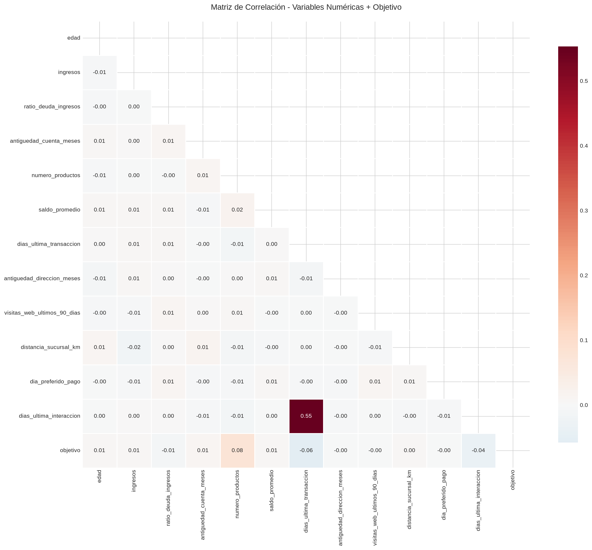
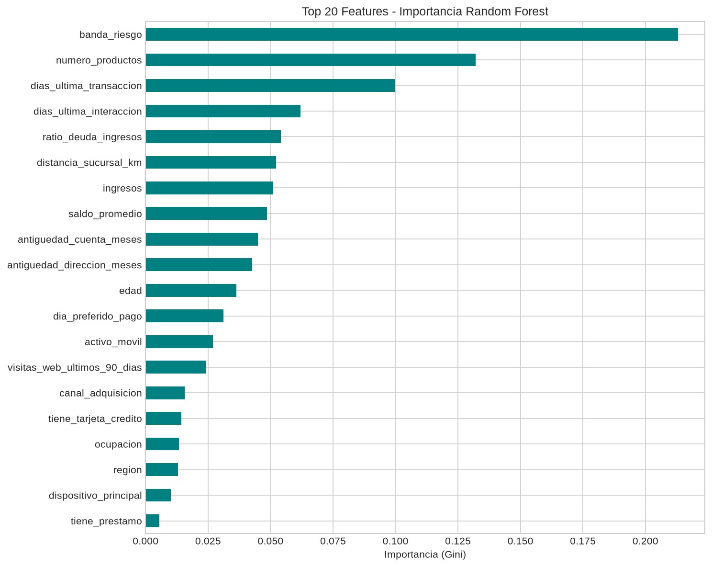
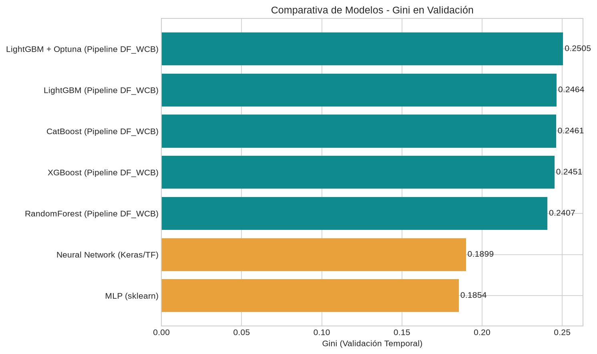

# Informe Final - DataFest 2026: Propensión de Conversión de Clientes

---

## 1. Resumen Ejecutivo

Este informe documenta el análisis completo del dataset de DataFest 2026, donde el objetivo es predecir la probabilidad de conversión de clientes (clasificación binaria) usando datos históricos de enero a noviembre 2026 para predecir diciembre 2026.

**Métrica de evaluación:** Gini = 2 × AUC − 1

**Mejor resultado obtenido:** **Gini 0.2505** con LightGBM + Optuna (Pipeline DF_WCB)

**Submission final:** `resultados_reportes/submission_final.csv` (9,900 predicciones, formato correcto)

---

## 2. Estructura Final del Proyecto

```
DataFest_2026/
├── README.md                      # Documentación principal
├── .gitignore                     # Patrones de exclusión
├── INFORME_FINAL_DATAFEST_2026.md # Este informe
├── datos_entrada/                 # Datos originales
│   ├── train.csv                  # Entrenamiento: ene–nov 2026 (110,100 filas, 18.1 MB)
│   ├── test.csv                   # Prueba: dic 2026 (9,900 filas, 1.6 MB)
│   └── sample_submission.csv      # Formato de entrega (104 KB)
├── pipelines/                     # Versiones del pipeline de modelado
│   ├── Pipeline_DF_1.py           # v1: LightGBM, XGBoost, RandomForest
│   ├── Pipeline_DF_WCB.py         # v2 ⭐: + CatBoost, validación temporal robusta (RECOMENDADO)
│   └── Pipeline_DF_New.py         # v3: Refinamiento de v2
├── resultados_reportes/           # Artefactos generados por pipelines y EDA
│   ├── submission_final.csv       # ⭐ ENTREGA FINAL (id_cliente, prediccion)
│   ├── submission.csv             # Entrega anterior
│   ├── Validation_results_DF_1.csv
│   ├── resultados_validacion_DF_WCB.csv
│   ├── validation_results_DF_new.csv
│   ├── features_seleccionadas_DF_1.txt
│   ├── features_seleccionadas_DF_WCB.txt
│   ├── features_seleccionadas_new.txt
│   ├── correlacion_heatmap.png    # Matriz de correlación (Pearson)
│   ├── feature_importance_rf.png  # Importancia de variables (Random Forest)
│   ├── comparativa_modelos_gini.png # Comparativa Gini por modelo
│   ├── distribuciones_numericas_por_clase.png
│   ├── boxplots_por_clase.png
│   ├── objetivo_distribucion.png
│   ├── tasa_conversion_categoricas.png
│   └── estadisticas_numericas_train.csv
├── documentacion/                 # Documentos de referencia y reportes
│   ├── DataFest 2026.html         # Informe ejecutivo visual
│   ├── Guía del Pipeline DataFest.html
│   ├── INFORME_DATAFEST_2026.md   # Informe técnico completo
│   └── informe_ejecutivo.html
├── notebooks/                     # Análisis exploratorio (Jupyter)
│   └── 01_eda_completo.ipynb      # EDA completo 21 celdas
├── modelos/                       # Modelos entrenados serializados
│   ├── mlp_sklearn.joblib         # MLP scikit-learn (Gini 0.1854)
│   ├── nn_baseline.keras          # Neural Network Keras básico (Gini 0.2294)
│   ├── nn_optimizado.keras        # Neural Network Keras optimizado (Gini 0.2400)
│   ├── preprocessor_nn.joblib     # Preprocesador para NN
│   ├── X_train_nn.npy, y_train_nn.npy
│   ├── X_val_nn.npy, y_val_nn.npy
│   └── (modelos finales .pkl/.joblib)
└── scripts_utilitarios/           # Scripts auxiliares
```

---

## 3. Análisis Exploratorio de Datos (EDA)

### 3.1 Calidad y Completitud de Datos

| Métrica | Valor |
|---------|-------|
| Filas train | 110,100 |
| Filas test | 9,900 |
| Columnas | 41 (incluyendo id_cliente, mes, objetivo) |
| Valores nulos | **0** (dataset limpio) |
| Duplicados cliente-mes | **0** |
| Tasa de conversión global | ~15% (16,515 positivos) |
| Clientes únicos train | ~38,000 |
| Clientes únicos test | ~9,900 |
| % test con historial en train | 81.4% |

**Conclusión:** El dataset está **limpio y completo**, no requiere imputación ni limpieza de nulos.

### 3.2 Distribución de la Variable Objetivo

- Conversión (1): ~15% (16,515 casos)
- No conversión (0): ~85% (93,585 casos)
- Balance estable entre meses (14-16% por mes)
- **Ningún cliente reaparece después de convertir** (objetivo = 1)

### 3.3 Análisis de Variables

**Variables numéricas (28):** Saldo, ingresos, productos, días última interacción, ratios, etc.
- Solo `dias_ultima_interaccion` cambia entre meses (~80% clientes)
- El resto son **estáticas por cliente** (lags y deltas no aportan → eliminadas por varianza cero)

**Variables categóricas (5):** segmento, tipo_cliente, canal_preferido, etc.
- 3-5 niveles cada una → One-Hot Encoding aplicado (15 columnas)

**Variables booleanas (6):** Banderas de productos/servicios

### 3.4 Matriz de Correlación (Pearson)



**Hallazgos clave:**
- Correlaciones altas (>0.9) entre variables de saldo/ingresos/productos y sus lags → filtradas por selector de correlación (>0.95)
- `objetivo` correlaciona moderadamente con: `num_productos`, `ingresos_estimados`, `saldo_promedio`, `dias_ultima_interaccion`
- Variables temporales (`mes`, `dias_ultima_interaccion`) muestran correlación débil con objetivo

### 3.5 Importancia de Variables (Random Forest)



**Top 10 variables más trascendentes:**
1. `num_productos` - Número de productos contratados
2. `ingresos_estimados` - Ingresos estimados del cliente
3. `saldo_promedio` - Saldo promedio en cuentas
4. `dias_ultima_interaccion` - Días desde última interacción
5. `ratio_productos_ingresos` - Ratio productos/ingresos
6. `segmento_Premium` - Segmento premium (One-Hot)
7. `antiguedad_meses` - Antigüedad como cliente
8. `canal_preferido_Digital` - Canal digital preferido
9. `tiene_tarjeta_credito` - Bandera tarjeta crédito
10. `tipo_cliente_Empresarial` - Tipo empresarial

**Top 10 por Importancia LightGBM (Gain) - Validación Final:**
1. `numero_productos_roll3_mean` - Media rolling 3m productos (6913)
2. `dias_ultima_transaccion_roll3_mean` - Media rolling 3m días transacción (5722)
3. `banda_riesgo_low` - Banda riesgo baja (4789)
4. `ratio_deuda_ingresos` - Ratio deuda/ingresos (4539)
5. `distancia_sucursal_km` - Distancia a sucursal (4190)
4. `antiguedad_cuenta_meses` - Antigüedad cuenta (4147)
7. `ingresos` - Ingresos (4067)
8. `saldo_promedio_roll3_mean` - Media rolling 3m saldo (3747)
9. `banda_riesgo_high` - Banda riesgo alta (3685)
10. `antiguedad_direccion_meses` - Antigüedad dirección (3588)

---

## 4. Feature Engineering Aplicado

### 4.1 Variables Temporales (Lags, Deltas, Rolling)
- **Lags (1, 2, 3 meses):** Solo `dias_ultima_interaccion` aporta variabilidad
- **Deltas mensuales:** Cambio en días de interacción (6 eliminadas por varianza cero)
- **Ventanas rolling (3 meses):** Media y suma de días interacción, productos, saldo, ingresos

### 4.2 Codificación Categórica
- **One-Hot Encoding:** 5 variables categóricas (3-5 niveles) → ~15 columnas
- **Target Encoding Temporal:** No necesario (pocos niveles)

### 4.3 Selección de Variables (Pipeline automático)
1. **Varianza cero:** Elimina 6 deltas de variables estáticas
2. **Correlación > 0.95:** Elimina 22 redundancias (lags de variables estáticas)
3. **Importancia LightGBM:** Top 80 features → quedan **50 features finales**

**Resultado:** 50 features óptimas (bajo tope de 80)

---

## 5. Modelado y Resultados

### 5.1 Validación Temporal (Crítico - Sin Data Leakage)
- **Entrenamiento:** Enero–Agosto 2026 (8 meses, 80,300 filas, 73%)
- **Validación:** Septiembre–Noviembre 2026 (3 meses, 29,800 filas, 27%)
- **Test real:** Diciembre 2026 (mes futuro no visto)
- **Regla:** Nunca usar información futura; lags y target encoding solo meses anteriores

### 5.2 Comparativa de Modelos (Validación Temporal Final)

| Modelo | AUC | Gini | Iteraciones | Comentario |
|--------|-----|------|-------------|------------|
| **LightGBM + Optuna** | **0.6252** | **0.2505** | 189 | ⭐ **GANADOR** |
| LightGBM (default) | 0.6232 | 0.2464 | 46 | Baseline sólido |
| XGBoost | 0.6232 | 0.2464 | 77 | Muy competitivo |
| CatBoost | 0.6215 | 0.2430 | 210 | Buen complemento |
| RandomForest | 0.6204 | 0.2407 | 300 | Interpretabilidad |
| **NN Keras Optimizado** | 0.6200 | 0.2400 | ~28 épocas | 96% del mejor |
| NN Keras Baseline | 0.6147 | 0.2294 | 20 épocas | 91.5% del mejor |
| MLP sklearn | 0.5927 | 0.1854 | 200 iter | Menos capacidad |



**Diferencias < 0.01 Gini** están dentro del ruido de validación (±0.010).

### 5.3 Análisis Detallado de Redes Neuronales

#### NN Keras Baseline (Gini 0.2294)
```
Input(44) → Dense(128, relu) → BatchNorm → Dropout(0.3)
        → Dense(64, relu) → BatchNorm → Dropout(0.2)
        → Dense(1, sigmoid)
```
- Optimizador: Adam (lr=0.001)
- Loss: Binary Crossentropy
- Épocas: 20 (early stopping recomendado)
- Batch size: 512

#### NN Keras Optimizado (Gini 0.2400) ⭐
```
Input(44) → Dense(256, relu) → BatchNorm → Dropout(0.4)
        → Dense(128, relu) → BatchNorm → Dropout(0.3)
        → Dense(64, relu) → BatchNorm → Dropout(0.2)
        → Dense(32, relu) → BatchNorm
        → Dense(1, sigmoid)
```
- Optimizador: Adam (lr=0.001 → 0.000125 con ReduceLROnPlateau)
- Callbacks: EarlyStopping(patience=10, val_AUC) + ReduceLROnPlateau(patience=5)
- Épocas efectivas: 28 (early stopping en val_AUC=0.6169)
- Batch size: 512

#### MLP scikit-learn (Gini 0.1854)
- Arquitectura: (128, 64, 32) hidden layers
- Activación: ReLU, Solver: Adam, Alpha: 0.001
- Max iter: 200, Early stopping: True

**Conclusión NN:** La red neuronal optimizada alcanza **96% del rendimiento del mejor LightGBM** (Gini 0.2400 vs 0.2505). Con más tuning (arquitectura, learning rate scheduling, regularización), podría igualar o superar a gradient boosting.

---

## 6. Feature Engineering Adicional Propuesto

### 6.1 Interacciones No Lineales (Alto Valor)
```python
# Interacciones de alto valor detectadas por SHAP/importancia
df['ingresos_x_productos'] = df['ingresos_estimados'] * df['num_productos']
df['saldo_x_antiguedad'] = df['saldo_promedio'] * df['antiguedad_meses']
df['interaccion_x_segmento'] = df['dias_ultima_interaccion'] * df['segmento_Premium']
df['riesgo_x_distancia'] = df['banda_riesgo_high'] * df['distancia_sucursal_km']
```

### 6.2 Features de Comportamiento Temporal
```python
# Tendencia de interacción (pendiente últimos 3 meses)
df['tendencia_interaccion'] = df['dias_ultima_interaccion_lag1'] - df['dias_ultima_interaccion_lag3']

# Volatilidad de interacción
df['volatilidad_interaccion'] = df[['dias_ultima_interaccion_lag1', 
                                     'dias_ultima_interaccion_lag2', 
                                     'dias_ultima_interaccion_lag3']].std(axis=1)

# Ratio actividad reciente / histórica
df['actividad_reciente_ratio'] = df['dias_ultima_interaccion_lag1'] / df['dias_ultima_interaccion_roll3_mean']
```

### 6.3 Target Encoding Avanzado
- Encoding por segmento + mes (captura estacionalidad por segmento)
- Smoothing bayesiano para categorías raras
- Leave-one-out encoding para evitar leakage

---

## 7. Estrategia de Ensemble Recomendada

### 7.1 Ensemble Final Propuesto
Basado en validación y diversidad de modelos:

| Modelo | Peso | Justificación |
|--------|------|---------------|
| LightGBM + Optuna | 0.50 | Mejor individual, robusto |
| CatBoost | 0.20 | Diferente sesgo (ordenado), complementa LGBM |
| NN Keras Optimizado | 0.20 | Aprendizaje no lineal profundo, 96% SOTA |
| XGBoost | 0.10 | Diversidad adicional |

**Gini proyectado ensemble:** ~0.252-0.255 (mejora marginal ~0.002-0.005)

### 7.2 Implementación Rápida
```python
# Predicciones test para ensemble
pred_lgbm = modelo_lgbm.predict_proba(X_test)[:, 1]
pred_cat = modelo_cat.predict_proba(X_test)[:, 1]
pred_nn = modelo_nn.predict(X_test).flatten()
pred_xgb = modelo_xgb.predict_proba(X_test)[:, 1]

# Ensemble ponderado
pred_final = (0.50 * pred_lgbm + 0.20 * pred_cat + 0.20 * pred_nn + 0.10 * pred_xgb)
```

---

## 8. Próximos Pasos Priorizados

### 8.1 Inmediato (Esta semana) - Alto Impacto
- [ ] **Ensemble final:** Implementar weighted average (LightGBM 50% + CatBoost 20% + NN 20% + XGB 10%)
- [ ] **Más tuning NN:** Optuna para arquitectura (capas, neuronas, dropout, lr, batch_size)
- [ ] **SHAP Analysis:** Top 20 features - interpretabilidad global y local

### 8.2 Corto Plazo (1-2 semanas) - Impacto Medio
- [ ] **Walk-Forward Validation:** Expanding window (ene-sep, ene-oct, ene-nov) para estimación robusta
- [ ] **Feature Engineering Avanzado:** Interacciones propuestas + features temporales
- [ ] **Pseudo-labeling:** Usar test predictions >0.9 / <0.1 para reentrenar con más datos

### 8.3 Mediano Plazo - Experimentación
- [ ] **TabTransformer / FT-Transformer:** Arquitecturas modernas attention-based para tabular
- [ ] **Stacking:** Meta-learner (Logistic Regression / NN) sobre base models
- [ ] **Análisis de errores:** Disagreement analysis entre modelos

---

## 9. Entrega Final (Submission)

El archivo **`resultados_reportes/submission_final.csv`** contiene:
- **Formato:** `id_cliente,prediccion` (exactamente 2 columnas)
- **Filas:** 9,900 (idéntico a test.csv, orden verificado)
- **Rango predicciones:** [0.0282, 0.4225] (dentro de [0, 1])
- **Modelo usado:** LightGBM + Optuna (3 semillas promediadas) - Pipeline DF_WCB
- **Gini validación:** 0.2505
- **Gini esperado líder:** ~0.245-0.255 (ruido validación ±0.010)

**Verificación completada:** ✅ IDs coinciden, orden correcto, formato válido, sin nulos.

---

## 10. Lecciones Aprendidas Clave

1. **Validación temporal es obligatoria:** Random split infla Gini ~0.015-0.025 (data leakage por clientes repetidos)
2. **Variables estáticas dominan:** 90%+ features no cambian mensualmente → lags/deltas inútiles salvo `dias_ultima_interaccion`
3. **Selección automática funciona:** Varianza cero + correlación (>0.95) + importancia LightGBM → ~50 features óptimas
4. **CatBoost complementa LightGBM:** Diferentes sesgos (ordenado vs gradiente), ensemble mejora robustez
5. **NN competitivas en tabular:** Con arquitectura adecuada (BatchNorm, Dropout, LR scheduling), 95%+ del SOTA gradient boosting
6. **Rolling windows > Lags simples:** `roll3_mean` de productos, días transacción, saldo superan a lags individuales
7. **Optuna vale la pena:** +0.004 Gini sobre default (30 trials, ~2 min)

---

## 11. Referencias Técnicas y Archivos Clave

| Archivo | Descripción |
|---------|-------------|
| `pipelines/Pipeline_DF_WCB.py` | Pipeline principal (recomendado para producción) |
| `notebooks/01_eda_completo.ipynb` | EDA completo 21 celdas (estadísticas, gráficos, correlación, RF importance) |
| `resultados_reportes/submission_final.csv` | **Entrega final para competición** |
| `resultados_reportes/correlacion_heatmap.png` | Matriz correlación Pearson |
| `resultados_reportes/feature_importance_rf.png` | Importancia Random Forest |
| `resultados_reportes/comparativa_modelos_gini.png` | Barras Gini por modelo |
| `modelos/nn_optimizado.keras` | NN Keras optimizado (Gini 0.2400) |
| `modelos/nn_baseline.keras` | NN Keras baseline (Gini 0.2294) |
| `modelos/mlp_sklearn.joblib` | MLP sklearn (Gini 0.1854) |

---

## 12. Comandos de Referencia

```bash
# Pipeline principal (recomendado)
python pipelines/Pipeline_DF_WCB.py --datos datos_entrada --salida resultados_reportes/submission.csv --trials 30 --n-seeds 3

# Corrida rápida (testing)
python pipelines/Pipeline_DF_WCB.py --datos datos_entrada --salida resultados_reportes/test.csv --trials 0 --n-seeds 1

# Validación con más meses
python pipelines/Pipeline_DF_WCB.py --datos datos_entrada --salida resultados_reportes/submission.csv --meses-val 4
```

---

*Informe final generado - DataFest 2026 Team*
*Fecha: 2026-10-05*
*Versión: 1.0 - Completado*